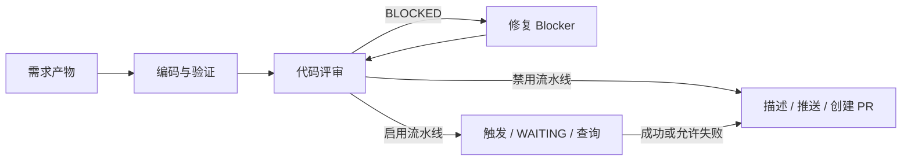

# DTCoder Agentic Dev

`dtcoder-agentic-dev` 是 Python 3.10+ 的可恢复研发工作流：从 Issue 建立隔离运行，驱动 Claude Code 或 Codex 生成需求、实现和评审，处理 Blocker，等待流水线并创建 PR。SQLite 保留全部运行历史，不以一个 Issue 状态承载全部执行状态。

> **工作区由系统管理，可能执行 `git reset --hard` 和 `git clean -fd`。不要把人工未提交代码放入代理工作区。** 失败运行默认保留现场，只有显式 `cleanup` 才清理。当前恢复策略保留工作树内容，不无条件重置。

## 当前能力与外部接入

项目已实现工作流内核、默认产品步骤、SQLite、租约、命令执行、Git/worktree、Claude CLI/可选 SDK、Codex CLI 适配器、异步模型运行时、模板、事件、前台调度和全部 CLI 命令。

内置 `AntCodeAdapter`、`ACIAdapter` 和 `DingTalkNotifier`，通过 code_host/pipeline/notification 的 adapter 配置在组合根装配。保留 `LoggingCodeHostAdapter`、`DisabledPipelineAdapter` 与 `NullNotifier` 的纯离线默认配置。未配置或 CLI 不支持所需远端查询/幂等能力时明确失败，不伪造外部成功。

真实 CLI 的内部版本尚未在当前环境核验。使用前请核对[接入契约与运维说明](docs/operations.md)，完成 CLI 登录、项目配置和服务器幂等验证；没有提供测试环境凭据时，代码验证全部使用替身。
`dry_run: true` 仅用于初始化、查询、配置和指定 Issue 入队演练，运行记录及模拟引用带演练标识。CLI 演练不执行 Codex、克隆、提交或推送，也不会虚构一套已成功完成的研发产物。

## 安装与从零初始化

```bash
python3 -m venv .venv
source .venv/bin/activate
pip install -e ".[dev]"
dtcoder-agentic-dev --help
dtcoder-agentic-dev init
# 或使用独立的配置/状态目录：
dtcoder-agentic-dev --config ./runtime/config.yaml init
dtcoder-agentic-dev --config ./runtime/config.yaml doctor
```

`init` 创建配置、SQLite schema、七个 Prompt 模板、十三个评论模板和两个 YAML 工作流模板，以及镜像、工作区及日志目录；重复执行保留用户修改的配置和模板。帮助命令不要求事先初始化。配置无效会输出中文错误，不显示堆栈。

默认目录：

```text
~/.dtcoder-agentic-dev/
├── config.yaml
├── state.db
├── prompts/
├── comments/
├── scheduler.pid
├── mirrors/<repository-id>.git/
├── workspaces/<repository-id>/<run-id>/
├── locks/runs/<run-id>.lock
└── logs/
    ├── scheduler.log
    └── runs/<run-id>/
        ├── run.log
        └── <step>/attempt-<n>/{prompt.txt,stdout.txt,stderr.txt,execution.json}
```

自定义配置路径时，未指定的状态目录和模板目录跟随配置文件目录；`state.database`、镜像和工作区的相对路径跟随状态目录。支持 `~` 和环境变量展开。不在 YAML 写入 Token、Cookie 或带认证的远端 URL，认证交由外部 Git/Codex 工具和自定义适配器管理。

## 架构与核心模型

依赖方向：CLI/Scheduler → Application → Domain/Engine → Ports；Adapters/Infrastructure 实现 Ports。`domain` 和 `engine` 不导入 SQLite、subprocess、Click 或具体平台。步骤只获得 agent executor、artifact store 和 clock；Git、流水线、平台与验证命令通过专用构造参数注入。

| 模块 | 职责 |
| --- | --- |
| `domain` | Issue、运行、尝试、产物、外部操作、错误、事件、节点图 |
| `engine` | 注册表、推进、技术重试、checkpoint、默认步骤 |
| `ports` | agent、平台、流水线、通知、存储、工作区、Git、命令、时间、ID 等协议 |
| `application` | 产品节点图、入队/控制/重跑/清理用例、事件处理与诊断 |
| `adapters` | Codex、SQLite、内存及本地能力诊断适配器 |
| `infrastructure` | 命令数组、Git、worktree、文件锁、产物摘要、日志 |
| `scheduler` | Issue 过滤与去重、原子领取、续租、调度与信号处理 |
| `cli` | Click 参数解析、组合根、中文展示 |

`Issue` 以 `(repository_id, external_id)` 标识，`number` 用于展示。仓库 ID 使用 `provider` 和 `project`（未指定时用 remote）的 SHA-256 摘要；重命名显示名称不会改变身份。

`WorkflowRun` 保存版本、状态、current_step、分支、工作区、乐观 revision、上下文、时间和租约。一个 Issue 可以有多个历史运行。`StepAttempt` 保留每次执行的输入快照、模板 SHA-256、输出、错误和产物。`Artifact` 保存相对路径、SHA-256 和 Git HEAD。`ExternalOperation` 保存意图、唯一幂等键及远端身份。完整字段和时序见 [架构文档](docs/architecture.md)。

## 默认工作流



需求步骤验证 `spec.md`、`plan.md` 和 `tasks.md` 非空，合法产物默认复用。宿主执行验证命令及有边界的 Git 暂存/提交，Codex 不负责 commit 或 push。编码没有业务变化会明确失败；崩溃发生在宿主已提交之后时，已有业务 diff 可以按恢复路径继续评审。

评审必须产生非空 `report.md` 和纯 JSON `summary.json`；字段、类型和 round 严格校验。`passed=true` 但 blockers 非空仍进入修复。修复只处理 Blocker，超过 `max_fix_loops` 失败；`passed=false` 而无 Blocker 进入需人工处理的失败结果。

流水线首次触发总是返回 WAITING，即使外部已返回成功；后续调度查询已保存的 ID。默认失败阻断，也可由 `pipeline_failure_blocks: false` 放行。PR 描述校验四个非空章节：Summary、Linked Issue、Changes、Test Plan。

产物路径：

```text
.agents/changes/issue-<number>/
├── spec.md
├── plan.md
├── tasks.md
├── pr_body.md
└── codereview/round-<n>/
    ├── report.md
    └── summary.json
```

## 配置

完整示例见 [config.example.yaml](config.example.yaml)，包内也分发同一示例。首次初始化不预设任何真实仓库。

```yaml
scheduler:
  poll_interval: 30
  lease_seconds: 120
  heartbeat_interval: 15
  max_nodes_per_tick: 20
codex:
  binary: codex
  extra_args: []
  output_format: text  # json 支持 JSON 对象或 JSONL 事件
  timeout: 1800
workflow:
  name: issue-development
  version: '1'
  max_retries: 2
  retry_delay: 1
  max_fix_loops: 3
code_host:
  adapter: logging  # 可设为 antcode
  binary: antcode
  profile: ''
  timeout: 60
pipeline:
  adapter: disabled # 可设为 aci
  binary: aci
  timeout: 60
  poll_interval: 30
notification:
  adapter: 'null'
  issue_comments: false
repositories:
  - name: sample
    provider: logging
    project: sample/project
    remote: https://example.invalid/sample/project.git
    base_branch: main
    labels: [agent-ready]
    authors: []
    reviewers: []
    remove_source_branch: false
    validation_commands:
      - [python, -m, pytest, -q]
    validation_timeout: 300
    pipeline_enabled: false
    pipeline_failure_blocks: true
```

上例 remote 是占位符，不可直接用于真实运行。`labels` 要求全部匹配，`authors` 为空表示不限作者。重复仓库身份或名称、未知字段、类型错误、非法分支、非正数/非有限时间、启用但未配置的流水线都报错。适配器名称允许自定义，但未装配时拒绝运行。内置 CLI 产品只装配 `issue-development` 版本 1；其他产品拥有自己的工作流和组合根。

## CLI

全局支持 `--config PATH`、`--version`、`-h/--help`。全局配置参数写在子命令前。

| 命令 | 行为 |
| --- | --- |
| `init` / `doctor` | 幂等初始化、仓库参数更新 / 只读工具、认证和远端分支诊断 |
| `run` / `run-once` | 前台循环 / 一个调度周期 |
| `process --repo sample --issue 123` | 显式新建并执行一个周期；演练仅入队 |
| `list [--all] [--repo sample]` | 默认展示活动运行；`--all` 包含历史记录 |
| `show --run ID` | 运行、步骤尝试、产物及外部操作 |
| `pause --run ID` / `resume --run ID` | 持久化控制；受管 agent 协作停止，YAML 支持反馈与会话续聊 |
| `cancel --run ID` | 持久化取消；回收该任务拥有的 agent 进程，保留现场 |
| `retry --run ID` | 终止运行的新一轮执行，旧记录不删除 |
| `cleanup --run ID` | 只清理该运行工作区，拒绝活动状态和有效租约 |
| `start` / `status` / `stop` / `restart` / `logs` | POSIX 后台进程、身份校验、优雅停止和日志跟随 |
| `rollback --run ID --step STEP --reason TEXT` | 展示计划，`--yes` 后创建后继，保留旧历史和备份引用 |
| `rollback-recover --run ID --reason TEXT --yes` | 显式恢复中断的回退意图与已记录后继 |
| `config show` | 展示配置，隐藏额外命令参数和验证命令中的潜在凭据 |

Poller 不会自动重复处理已经终止的 Issue，重跑必须显式 `process` 或 `retry`。SIGINT/SIGTERM 停止新任务领取并等待当前原子步骤完成。单个运行或单个仓库出错不会终止整个调度器。`run-once` 遇到运行失败或仓库轮询失败返回非零。

## SQLite、恢复与幂等

schema 版本为 1，启动自动创建表。新增运行记录采用 JSON payload 可选字段扩展并兼容旧 payload；未知 schema 版本拒绝打开，结构升级需显式迁移。记录的全量 dataclass 内容以 JSON payload 存储，索引、租约、revision、调度时间及唯一性字段使用关系列，行转换集中在 SQLite 适配器。

节点开始前保存 RUNNING 尝试；完成时在同一事务内先保存尝试和产物，再更新运行及领域事件。事件提交后同步投递，通知/评论错误只记录 warning 和处理器错误类型。可选 Issue 评论使用独立的幂等操作记录，不覆盖主结果。

领取在 `BEGIN IMMEDIATE` 内按状态、租约及 `next_poll_at` 原子执行，revision 防止丢失更新。后台续租保护长时间 Codex 命令；过期租约可由新 worker 领取。生产装配还为每个 run 加跨进程执行锁，确保失去租约但尚未结束的旧命令不会与新 worker 共同修改 worktree。仓库镜像操作也有独立文件锁。

恢复从 current_step 开始，不删除历史尝试；崩溃留下的 RUNNING 尝试记录为 `ProcessInterrupted`，新尝试递增编号。编码前的未跟踪文件快照持久化，恢复不会把原先存在的无关未跟踪文件默认暂存。暂存使用 `git add -u`、明确产物路径和本步骤新增的未跟踪文件，不使用无边界 `git add -A`。

每个运行拥有唯一工作区和稳定分支；requested_branch 作为分支前缀，末尾添加完整 run_id，避免重跑冲突。基础分支在创建前 fetch，评审基准固定为创建时的修订；恢复不改变已保存基准。可选本地 `path` 只用于镜像初次克隆的源，随后将 origin 指向配置的 `remote`，确保同步与推送面向正确远端。

幂等记录先于远端调用保存。PR 在重执行时先用同键查询远端，已经存在则对账；流水线 `trigger` 必须在远端按键去重；AntCode 评论使用标记查询与同机键锁对账。服务器提供原子去重才可完全关闭“远端成功、本地还没保存”的崩溃窗口。**仅靠 SQLite 唯一键无法保证跨系统恰好一次**；自定义适配器必须落实这个契约。内置 ACI 要求按键查询并要求服务端去重；AntCode 标记方案仍受远端一致性约束，详细边界见运维文档。

## 扩展适配器或第二个产品

实现 `ports` 下的 Protocol，通过 `build_runtime(..., code_host=..., pipeline=..., agent_executor=...)` 注入，或编写自己的组合根。网络错误映射成 TechnicalError；未配置能力用 CapabilityNotConfigured。所有命令交给 CommandRunner，不能在业务步骤拼装 subprocess/Git/Codex 命令。

新产品只需提供 `WorkflowDefinition`、`WorkflowStep` 和装配。注册节点所用步骤，校验图，并创建版本匹配的 WorkflowRun 即可复用引擎、SQLite 和租约。测试中另一个文档产品工作流无需修改核心引擎便可执行成功。条件是 Python callable，不执行 YAML 中任意表达式；不支持插件热加载。

## 测试与验证

```bash
pip install -e ".[dev]"
pytest -q
python -m compileall -q src tests
ruff check src tests
ruff format --check src tests
dtcoder-agentic-dev --help
dtcoder-agentic-dev init --help
dtcoder-agentic-dev doctor --help
dtcoder-agentic-dev rollback --help
python -m build
```

测试通过 autouse 防护拒绝真实网络、真实 Claude/Codex 和 Git commit/push/merge/rebase。默认步骤完整链路使用文件产物、SQLite 和测试替身。Git 提交/推送只验证参数数组；真实 worktree 使用 Git 2.42+ 的 orphan 功能，无需创建提交。旧 Git 会跳过这一项，可设置 `DTCODER_TEST_GIT=/path/to/new/git pytest -q` 完整验证；产品常规有提交仓库的 worktree 不依赖 orphan。

本地开发环境如已安装依赖，可加 `--no-build-isolation --no-index` 离线验证可编辑安装。本次开发的实际验收记录见 [docs/verification.md](docs/verification.md)。

## 已知边界和下一步

- 当前文件锁基于 POSIX `fcntl`，支持 macOS/Linux；Windows 需补充锁适配器。
- 默认单 worker；数据库、租约和同机执行锁支持后续多个进程，不宣称跨主机共享 SQLite 的分布式一致性。
- 同步事件投递不含持久化 outbox 重发器；失败被审计，进程在提交后、投递前崩溃可能漏发通知，主工作流仍可恢复。
- Prompt 明确限制文件范围；这是行为约束，不是操作系统权限沙箱。真实运行需使用受控凭据与受管 worktree。
- 尚未实现 Web 后台、队列、Kubernetes、多租户或生产部署；当前包含 v1 JSON payload 的兼容读取，尚不支持不同数据库 schema 版本间的迁移。
- AntCode/ACI 内部 CLI 的具体部署版本、认证与服务器原子幂等仍需在真实测试环境做契约核验；CLI 没有完整查询或按键契约时明确拒绝外部创建。
- 钉钉 direct 模式不自动获取/刷新 access token；长期运行推荐由企业网关管理认证续期、身份映射与去重。无持久化 outbox，通知不能保证必达。
- 后台 PID 管理与回退仅支持 POSIX 单机。回退保留原分支和历史，创建独立后继，不处理已合并 PR 或自动强推远端。

真实配置、迁移、回退恢复与服务部署完整示例见 [docs/operations.md](docs/operations.md)。

## 声明式 YAML 任务（第一批交付）

新增 `agent-auto-dev` 兼容命令别名。可通过自然语言需求和 YAML 模板立即提交单仓或无仓任务，复用原引擎、SQLite、租约、heartbeat 和执行锁。支持 agent/tool 注册、stage/job 顺序、有限安全循环、产物规则、审批/人工产物、脱敏反馈、失败节点重试及运行快照恢复。

```bash
agent-auto-dev --config ./runtime/config.yaml init
# 完全离线的工具示例，不调用模型：
agent-auto-dev --config ./runtime/config.yaml submit \
  --workflow ./runtime/workflows/local-files.yaml --task '验证文件处理流程'
# 根据自然语言生成文档；真实调用 Codex：
agent-auto-dev --config ./runtime/config.yaml submit --task '整理项目运维流程'
```

init 安装用户模板且保留已有副本。新初始化 document.yaml 的 agent 默认路由到 Claude CLI，旧配置继续 Codex；已接入 Claude CLI/SDK、异步取消和 session resume，多仓、HTTP 服务、面板及备份服务仍为后续批次。原 Issue 工作流、重跑/回退和外部适配器保持兼容。命令工具默认关闭，不会因为解析模板而执行外部命令。

完整可用能力、YAML 格式、持久化兼容性、操作说明与具体边界见 [声明式工作流](docs/workflows.md) 和 [应用服务边界](docs/api.md)。


## 多执行器运行时（第二批）

新初始化使用 `agents.default_engine: claude-cli`，认证沿用 `claude auth login` 的登录态。无需填写认证值。已有配置未声明 agents 时继续使用 Codex，并记录迁移提示；`init` 不覆盖用户配置。显式设置 `codex-cli` 可继续使用原引擎。

```yaml
agents:
  default_engine: claude-cli
  model_routes: {} # 精确模型名到引擎的映射
  max_concurrency: 4
claude:
  binary: claude
  model: ''
  output_format: stream-json
  max_turns: 20
  allowed_tools: [Read, Write, Edit]
  permission_mode: acceptEdits
  timeout: 1800
  sdk_fallback: false
```

YAML agent 可选 `default`、`claude`/`claude-cli`、`claude-sdk`、`codex`/`codex-cli`。default 按配置和精确模型路由选择；未知名称拒绝。提交时把实际引擎、已配置默认模型和中英文 Prompt 模板写入 resolved 快照，恢复不重新选择。节点 model 优先。可选 SDK 使用 `pip install ".[claude]"`；只有 SDK 无法导入且显式开启 sdk_fallback 时才回退 CLI，记录实际引擎，执行失败不回退。

```bash
agent-auto-dev --config ./runtime/config.yaml submit --task '整理项目接口和运维说明'
agent-auto-dev --config ./runtime/config.yaml pause --run RUN_ID
agent-auto-dev --config ./runtime/config.yaml resume --run RUN_ID --mode continue_conversation --feedback '补充失败处理流程'
agent-auto-dev --config ./runtime/config.yaml run-once
# 续聊遇到临时失败时保留会话重试；使用 revise 则开始新尝试：
agent-auto-dev --config ./runtime/config.yaml retry --run RUN_ID --mode continue_conversation
```

manager 提供异步提交、瞬时状态查询、取消、超时与停止回收；SQLite attempt、租约和执行锁仍是事实源。CLI 模型进程以独立进程组运行，取消只回收拥有的进程组。流式 session 和进程归属在当前 attempt 中持久化；旧进程组仍存在时恢复暂停，禁止启动第二个 writer。同步注入的替身/第三方 Port 需要遵守协作取消契约，否则只能等待其原子动作完成。

Claude SDK 支持流式首次调用、session resume、超时和取消，但 SDK 公共接口尚未提供可验证的进程归属证明，因此中断 SDK attempt 不自动恢复，进入人工 revise。CLI 中断只在 session、引擎、冻结定义均匹配且旧进程组已退出时自动续跑。缺失/丢失会话不会静默新建；失败不覆盖旧成功事实或清除反馈。

本批尚未实现结构化 handoff、reset、多仓提交/回退、HTTP API、React 面板、资源水位、备份与定时清理。旧 Issue 工作流继续兼容，仍待后续迁移为 YAML。完整运行边界见 [工作流文档](docs/workflows.md)。

## 使用本地 Claude Code 做真实验收

已在本地 CLI 2.1.63 上验证首次任务、submit CLI、暂停/同 session 续聊、取消和启动阶段超时。运行事件上报的实际模型为 deepseek-v4-flash。可运行 `.venv/bin/python scripts/e2e_claude.py --case basic` 复现；该命令会产生真实模型用量，验收工作区和脱敏日志保留在打印的临时目录中。普通 pytest 仍禁止真实模型访问。其他用例和验证边界见 [本地端到端验收](docs/claude-e2e.md)。
