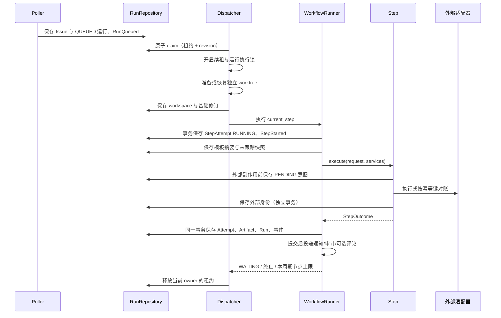

# 架构与执行语义

## 模块职责和依赖规则

系统分成可复用工作流内核、研发产品编排和基础设施适配器。

```text
CLI / Scheduler
       ↓
Application Services
       ↓
Domain + Workflow Engine
       ↓
Ports
       ↑
Adapters / Infrastructure
```

`domain` 定义记录、错误、事件、路径边界和显式图，不读取配置、数据库或进程。`engine/runner.py` 使用存储、事件、时间、ID、sleep 和可选 HEAD 读取函数；不持有具体平台。`engine/steps` 是当前产品的节点实现，通过专用构造参数接收 Git/命令/平台/流水线能力。`application/workflows.py` 定义默认节点图。`cli/bootstrap.py` 是具体依赖唯一的组合根。自动化测试检查 domain/engine 的包内导入只指向 domain/ports/engine。

StepRequest 为 frozen dataclass，运行、Issue、仓库和前序输出都是独立副本，输出映射只读；内部模型的可变字段仅能改变该步骤自己的副本。持久化结果必须通过 StepOutcome，不依赖步骤暗改全局状态。StepServices 明确只有 AgentExecutorPort、ArtifactStore、Clock。

## 领域模型

| 模型 | 核心字段 |
| --- | --- |
| Issue | provider、repository_id、external_id、number、title、body、author、url、state、labels、assignees、requested_branch、raw |
| WorkflowRun | run_id、workflow_name/version、repository_id、issue_external_id/number、status、current_step、branch/base_branch、workspace_path、revision、context、created/updated/started/finished_at、lease_owner/expires_at、last_error |
| StepAttempt | attempt_id、run_id、step_name、attempt_number、status、started/finished_at、input_snapshot、output、error_type/message、artifacts、metadata |
| Artifact | artifact_id、run_id、step_name、kind、relative_path、sha256、git_revision、created_at、metadata |
| ExternalOperation | operation_id、run_id、operation_type、idempotency_key、status、external_id/url、request/response_snapshot、created/updated_at |
| DomainEvent | event_id、type、run_id、created_at、step、payload |

时间使用 Clock 提供的 UTC Unix 秒；无隐式系统时间默认生成。ID 由 IdGenerator 注入；测试使用递增 ID。时间、等待和外部命令均可替换。

## 工作流定义

图使用 `NodeDefinition(name, step, terminal)`、`Transition(source, target, on, condition)` 和带版本的 WorkflowDefinition。启动时检查名称、起点、引用、重复迁移、无条件歧义、可达性与终止路径；注册表检查所有 step 已装配。callable 条件只能来自产品代码。运行时若多个条件同时匹配或没有合法迁移，运行失败，不猜测下一节点。

默认节点：requirements → coding → review；review BLOCKED → fix → review；review SUCCEEDED 依据 pipeline_enabled 分流；pipeline 成功或配置允许失败后进入 create_pr。coding 的恢复 SKIPPED 也进入 review，create_pr 是终止节点。

技术错误按 `min(30, initial_delay * 2**(retry_number-1))` 重试，max_retries 是初次执行之外的次数。退避及失败计数持久化；同一节点的业务阻断不计技术次数。每个调度周期最多推进 max_nodes_per_tick 次（包括技术重试），达到上限让出 worker，当前节点仍可恢复。

## 关键时序



外部网络调用不包在主数据库事务中，不在事务中阻塞 Codex。Git 提交由宿主 GitClient 负责；文件变化和 Git 无法与 SQLite 组成原子事务，因此通过持久化输入、产物复用、已提交业务 diff 和远端幂等来恢复。

节点完成时记录 Git HEAD，产物和尝试均引用该修订。HEAD 读取失败作为节点技术失败处理，保留恢复基线。输入快照包含运行、Issue、前序输出及模板摘要；只保存声明的数据，不记录全量环境。

## 状态迁移

| 当前运行状态 | 动作或结果 | 下一状态 |
| --- | --- | --- |
| QUEUED | 成功领取并启动 | RUNNING |
| RUNNING | 节点成功/阻断/跳过，有后继 | RUNNING；current_step 更新 |
| RUNNING | WAITING 且有 next_poll_at | WAITING |
| WAITING | 到期领取 | RUNNING，继续同一节点 |
| RUNNING | 技术错误，尚有重试 | RUNNING，失败计数及退避持久化 |
| RUNNING | Fatal、技术耗尽、FAILED 或无合法迁移 | FAILED |
| RUNNING | 终止节点完成 | SUCCEEDED |
| QUEUED/RUNNING/WAITING | pause | PAUSED |
| PAUSED | resume | QUEUED，或恢复原 WAITING |
| 任意活动状态 | cancel | CANCELLED |
| 任意终止状态 | retry | 创建新的 QUEUED 运行；旧记录保持 |

暂停和取消可在外部命令执行时更新 revision。步骤完成事务重新加载最新运行，保留用户控制状态，仍保存完成记录。暂停期间成功节点推进 current_step；终止节点完成记录 deferred completion，resume 后成为 SUCCEEDED。暂停期间的 Fatal 仍结束运行；技术失败保留计数和恢复输入，取消保持终止。取消不是强杀：当前步骤可能完成提交、远端请求等已开始动作。

步骤尝试独立使用 RUNNING/SUCCEEDED/BLOCKED/WAITING/SKIPPED/FAILED，不与节点名混合。恢复旧 RUNNING 尝试改为 FAILED，错误类型 ProcessInterrupted，新增尝试而不重用 attempt_id。

## 数据表和事务

SQLite 开启 WAL、外键和 busy timeout；使用 `BEGIN IMMEDIATE` 与 RLock，嵌套事务通过 savepoint 实现。

| 表 | 唯一键和关系字段 | 存储内容 |
| --- | --- | --- |
| schema_version | 单版本记录 1 | 当前 schema 版本；未知版本拒绝打开 |
| repositories | repository_id | 安全仓库配置 payload |
| issues | (repository_id, external_id)，编号索引 | Issue payload |
| workflow_runs | run_id；活动 Issue 部分唯一索引 | 状态、revision、租约、next_poll_at、created_at、全量 payload |
| step_attempts | attempt_id；(run_id, step_name, attempt_number) | 尝试快照与结果；run 外键 |
| artifacts | artifact_id | 产物元数据；run 外键 |
| external_operations | operation_id；idempotency_key UNIQUE | 意图与远端身份；run 外键 |
| domain_events | event_id | 事件及处理失败审计；run 外键 |

所有 JSON/枚举/行转换集中在适配器，不在业务层散落 SQL。`update_run` 按 revision 条件更新，成功后递增；领取也递增 revision，续租与释放只更新租约关系列。读取时租约、status 和 revision 以关系列为准，防止 payload 覆盖续租。

活动唯一索引覆盖 QUEUED/RUNNING/WAITING/PAUSED，防止 Poller 竞争创建相同 Issue 的活动运行。终止记录不受该限制。保存外部意图和唯一键竞争失败抛 ConcurrencyConflict，不根据数据库异常文本决策。

## 租约和同机互斥

领取条件：可调度状态、没有 owner 或 lease_expires_at 已到期、next_poll_at 已到期。挑选和写 owner/expires/revision 在一个事务内完成，因此两个独立连接只有一个能领取同一 run。

续租必须属于当前 owner 且租约未过期；过期 owner 不能复活自己的租约。释放以 owner 条件更新，旧 worker 不会释放新 worker 的租约。长外部调用期间使用可停止的后台心跳，主引擎在步骤前和事务提交前再次校验租约。

产品组合根为每个 run 配置 POSIX 文件执行锁，防止旧 worker 租约失效但子进程仍运行时，新 worker 与它并发修改同一 worktree。新 claimant 等待此锁时仍心跳续租，获得锁后再次校验租约。cleanup 使用同一锁，不删除尚在执行的工作区。镜像创建、同步、worktree 注册和删除有仓库级文件锁。

数据库租约不是跨主机的分布式 fencing token。第一阶段使用单机 SQLite + 同机文件锁；后续跨主机执行需替换存储和执行隔离方案。

## 外部操作幂等

- PR 幂等键：`<run_id>:create_pr`。
- 流水线幂等键：`<run_id>:pipeline`。
- 评论幂等键：`<run_id>:comment:<event_id>`。

先保存 PENDING 和 request_snapshot，再调用远端。远端成功后保存 external_id/url 与 response_snapshot。正常恢复已有流水线 ID 时只调用 get_status；首次进入必须 WAITING，让调度器释放执行周期。

PENDING 但没有远端 ID 代表请求可能未发送，也可能已成功但本地未落盘。CodeHost 的 find_pull_request 必须按键查询；若存在，只对账。Pipeline 的 trigger 必须提供远端按键去重。内置 ACI 先按键查询，再将同键交给触发接口；AntCode 评论和 PR 使用稳定正文标记查询并加同机锁。标记方案仍依赖远端读取一致性与列表完整性，不宣称跨主机原子去重；SQLite 不能独自保证这些性质。

触发操作 SUCCEEDED 表示“触发请求已完成”，并不表示流水线已通过；流水线最终结果记录在运行上下文与事件中。PR URL 在成功 outcome 的 external_refs 中进入 context，并随运行保存。

通知/评论同步投递失败审计 warning 和 handler/error_type，不回滚主事务，也不将成功运行改为失败。当前没有持久化 outbox 自动重放，事件投递不保证恰好一次。

## 工作区、命令与模板

每个 run 对应 `workspaces/<repository-id>/<run-id>`，镜像维护远端 namespace 的 refs，避免 fetch 覆盖已被 worktree 使用的工作分支。创建前同步基础分支，基准 SHA 存入 context，恢复复用已有 worktree，拒绝分支或受管路径不匹配的目录。清理只操作指定 run，不删其他 worktree 或历史记录。

GitClient 集中实现克隆、fetch、worktree、状态、reset/clean、未跟踪快照、有边界暂存提交、push、HEAD 和 diff。CommandRunner 一律使用参数数组、shell=False、UTF-8、明确超时，不输出环境变量或完整命令参数。非零返回由调用方决定是否抛错。超时和启动失败属于 TechnicalError 的具体类型。

CodexAdapter 统一构造 `binary exec [extra_args] [--json] -`，通过 stdin 非交互传入 prompt，cwd 必须是当前隔离 Git 工作区。输出支持文本、单 JSON 对象或 JSONL 对象事件；结构化失败明确映射 TechnicalError。每次保存提示词、输出、错误和执行元数据，不自行从环境生成认证配置。CLI 版本差异通过 binary/extra_args 和集中 build_command 调整。

模板只支持简单 `{variable}`；缺失变量、缺失模板、字段访问或格式表达式报明确错误。模板 SHA-256 保存到 attempt 输入。literal JSON 使用双大括号。文件路径约束防止产物越出 workspace；Prompt 文件范围规则是行为约束，不代表 OS 沙箱。

## 第二个产品接入

1. 在产品层定义另一个具名、带版本 WorkflowDefinition，使用 Python callable 条件。
2. 实现 WorkflowStep 的 execute；通过 StepOutcome 返回事实、产物、远端引用和 WAITING 时间。
3. 仅在确实需要时注入专用能力，保留 StepServices 的能力范围。
4. 注册步骤，创建该工作流版本的 WorkflowRun，使用自己的应用用例和组合根。
5. 复用 WorkflowRunner、RunRepository、租约、事件及基础设施；无需修改或复制核心引擎。

`test_second_product_without_core_modification` 展示版本 2 的文档产品，完全绕过默认研发节点仍正常完成。原 process CLI 的产品配置仍仅接受默认研发工作流；新的 submit CLI 接受独立 YAML 定义，共用同一引擎。

## 验证策略与范围

单元测试覆盖模型、配置、图、注册表、错误分类、退避、模板、命令、Codex、状态控制和事件隔离。集成测试覆盖 SQLite 事务、并发领取、重开恢复、完整默认步骤、修复循环、流水线幂等、PR 崩溃窗口及真实 worktree 隔离。

所有测试禁止真实网络和真实 Codex。Git commit/push/merge/rebase 在测试级守卫中禁止，提交/推送只用命令 mock。真实 worktree 测试使用较新 Git 的 --orphan，不制造测试提交；较老 Git 可指定 DTCODER_TEST_GIT 或跳过此单项。

后续优先：真实平台/CI/通知契约、远端幂等验证、持久化事件重发、故障注入和多进程压力测试。目前未实现数据库结构迁移、旧独立 JSON 导入、双写、Web、队列、Kubernetes 或生产部署；v1 payload 的新增可选字段保留兼容读取。


## 新增产品外部装配

AntCode/ACI 仅在 adapters 层构造命令，通过 CommandRunner 执行；JsonCLI 统一处理安全错误、banner JSON、完整列表和能力检测。PR 请求支持 reviewer 与源分支清理，流水线请求支持 commit。领域与通用引擎不导入 HTTP、平台或模板目录。

EventViewBuilder 在 application 层把已提交事件、attempt、artifact、run 和 Issue 映射成统一评论/通知视图。IssueCommentHandler 先持久化评论意图，AntCode 远端查标记后创建；DingTalkNotifier 依赖该视图和可注入 HttpTransport。标准 HTTP 实现在 notification adapter 内，凭据只在请求时从命名环境变量读取，异常不保存响应和认证信息。PipelineCancellationHandler 处理取消与迟到的触发事件，失败由已有事件隔离机制审计。

默认装配仍为 logging/disabled/null。dry_run 直接选择离线装配，跳过评论处理器、通知与真实 CLI，拒绝回退，不会从真实配置意外产生远端调用。daemon 进程操作位于 infrastructure，CLI 提供命令入口；所有平台调用仍使用 CommandRunner 参数数组。

## 回退模型与并发边界

回退是产品应用用例 RollbackService，不修改 WorkflowRunner 的 attempt 语义。目标为节点最新 attempt 的输入 SHA；必须属于原运行记录且是当前分支祖先。独立后继携带该输入上下文、rollback_from、rollback_operation 和 rollback_revision，不复制原 attempts 或外部操作键。后继使用原受管镜像在指定 SHA 建立独立 worktree。旧终止运行不变；旧暂停运行通过真实 CANCELLED 转移并记录 superseded_by，以保留活动 Issue 唯一性。

流程：非阻塞执行锁 → 状态/租约/attempt/工作区/祖先/PR 校验 → 展示计划 → 用户 --yes → PENDING 回退操作 → 备份引用 → 逐项远端动作并持久化结果 → 事务创建 PAUSED 后继并终止原暂停运行 → 指定 SHA 准备工作区 → 事务入队后继、完成操作和保存事件 → 提交后评论/通知。

原子操作不包在长 SQLite 事务中。PENDING 回退意图阻止原运行和后继的控制/清理，以及同 Issue 新入队；操作完成后恢复原有控制逻辑。计划 revision 与执行时 revision 一致性校验防止计划过期。与运行租约及同机非阻塞锁共同防止回退时覆盖活动执行。

ExternalOperation.operation_type=rollback 保存计划、操作者、原因、前后 SHA、时间戳备份引用、逐项远端结果、后继 ID 和失败类型。部分动作可能已发生，失败不会撤销或虚构原有事实。workspace 创建失败后继仍暂停并携带目标 SHA；显式 resume 时仍使用 prepare_at。

进程崩溃留下 PENDING 时，rollback-recover 取得同一锁：存在相符暂停后继且远端动作完整成功审计时恢复其 worktree 并入队；没有后继时明确记 ProcessInterrupted/FAILED，重新规划会查询实际远端状态。不存在可靠输入修订、PR 已合并或远端身份不明时拒绝推测。恢复与结果发 RunRolledBack 事件；无新增 schema 表，沿用版本 1 的 JSON payload 与操作索引。

外部 CLI 协议、真实服务验证边界、认证续期和单机服务示例见 [operations.md](operations.md)。

## 声明式任务扩展（第一批）

Application 的 `yaml_workflows` 负责严格 YAML 解析和图编译，Domain 的 declarative 模型只表达数据与标量比较。ExecutorRegistry 显式注册 agent/tool；DeclarativeStep 实现既有 WorkflowStep，通过 AgentExecutorPort、ToolExecutor、ArtifactStore 与 ExecutionJournal 执行。CLI submit 与既有 Dispatcher 共用 WorkflowRunner、事务、CAS、租约、heartbeat、文件锁和事件分发，未复制第二套调度/状态引擎。

YAML run 保存原始/实际定义文件的摘要引用，恢复时只读取冻结快照。stage execution、pause/fail point、feedback 使用 v1 payload 的版本化可选记录，attempt 新增可选 error_code；旧 payload 兼容读取。日志由文件 Journal 保存，有界摘要进入状态。无仓任务使用独立受管目录及身份标记，不伪造 Git 仓库；单仓仍复用原 worktree。

原 Issue 产品节点图继续兼容；本批尚未把其评审、流水线和远端语义迁移为 YAML 模板。新自然语言 submit 统一通过 YAML 编译。旧重跑创建新 run；YAML retry 保留当前 run 和全部 attempts，仅恢复失败 job。后续迁移须保持这项公开行为说明与测试。

详细 schema、恢复边界、工具白名单、人工语义与后续未实现项目见 [workflows.md](workflows.md)，应用服务边界见 [api.md](api.md)。
